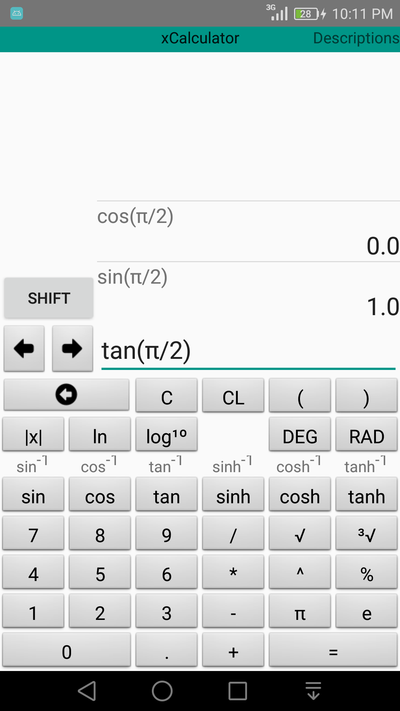
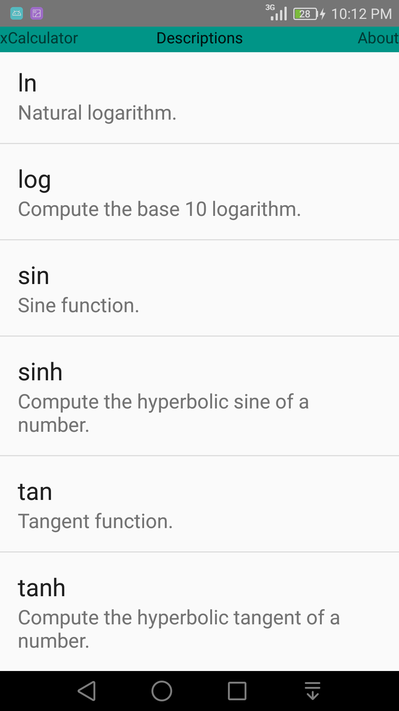
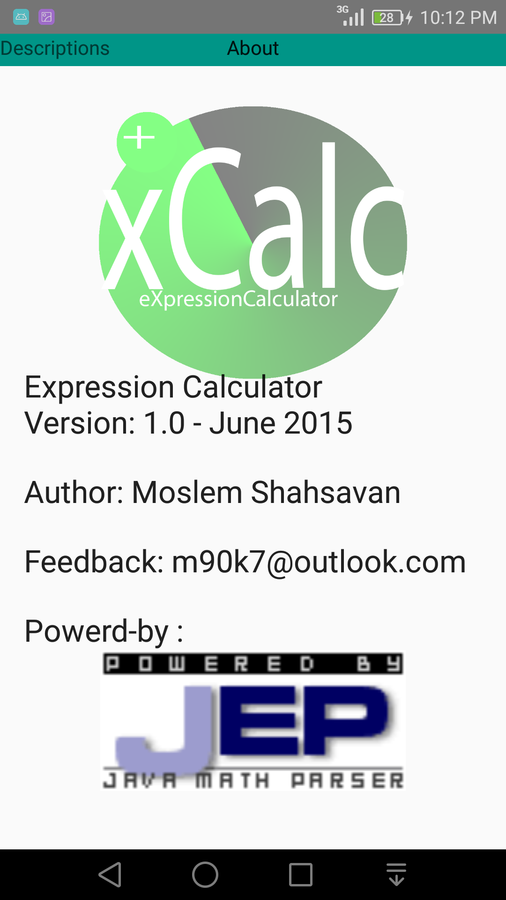

## eXpression Calculator (xCalc) ⚖ 🐉

Fun android expression calculator 😁 😅

---

#### 🐨 Overview: 

    1. Use JEP third party
    2. Command Pattern (design pattern)
    3. Fragment Component
    4. Flexible Layout

#### 🎨 Screenshot:

##### 🛕 Build Project

    Build project with Android Studio

##### 🩳 License MIT